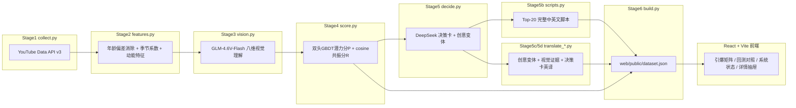

# 微光寻者 Glimmer Scout

> Catch Glimmer Before Dawn —— 在小体量运动创作者被主流雷达捕捉之前，提前发现即将起势的达人，
> 并为品牌方（demo 场景：Insta360）自动生成人货匹配理由与本地化裂变脚本。

**在线预览**：
- Vercel（生产）：https://web-flame-two-76.vercel.app
- GitHub Pages：https://chenyvhang.github.io/glimmer-scout/

两个部署互为镜像，代码完全一致（`web/vite.config.ts` 按 `process.env.VERCEL` 自动切换 base path）。

---

## 这是什么

Glimmer Scout 是一个**端到端的达人营销发现系统**demo：从 YouTube 真实采集运动类创作者数据开始，
经过特征工程、多模态视觉理解、机器学习打分、LLM 决策生成，最终产出一个可交互的前端——
按"潜力分 P × 共振分 R"对上千个运动类 YouTube 频道排序，为每个候选人生成本地化推广脚本。

项目的核心原则是**诚实优先**：宁可承认"这部分还没做/做不到"，也不伪造数据或指标撑场面。
四个功能层（数据层/匹配层/裂变层/复盘层）里，覆盖不到的频道字段一律显示为 `null` 并在前端
渲染"待分析"/"未生成"，从不用假数据填充；模型指标（AUC 太低、某些订阅分层 lift < 1）如实
展示，不通过调参或换指标让数字好看。详见下方"诚实声明"一节。

---

## 四层架构

对外用"数据层 / 匹配层 / 裂变层 / 复盘层"描述整个系统，对内实现方式不变——不为了套用框架
而引入无法用真实数据支撑的黑箱模块。

| 架构层 | 对应实现 | 真实程度 |
|---|---|---|
| **数据层** | Stage1 采集（YouTube Data API v3）+ Stage2 特征工程 | 完全真实：真实 API 采集，年龄偏差已验证消除（分箱漂移斜率 ≈0.000 < 0.05 阈值） |
| **匹配层** | Stage3 多模态视觉理解（GLM-4.6V-Flash）+ Stage4 双头 GBDT 潜力分 P + cosine 共振分 R | 真实但**接受妥协**：不引入"预训练神经网络"黑箱匹配模型——demo 规模没有真实人货匹配监督标签，无法真训练该类模型；用可解释、可回测的 GBDT + cosine similarity |
| **裂变层** | Stage5 决策卡（多个本地化创意变体）+ Stage5b 完整脚本（Top-20）+ Stage5c/5d 英文翻译 | 真实：全部由 DeepSeek 真实生成/翻译，非模板套话 |
| **复盘层** | 前端 localStorage 结果录入 + 真实 permutation importance / cosine 分维贡献 | `live_with_caveat`：结果记录与模型归因是真的，但广告投放/转化数据、ROI 归因仍待接入——demo 没有真实转化数据，不伪造因果看板 |

---

## 数据流全景



每个 Stage 都产出一份可独立检查的中间文件（`raw/` → `artifacts/features.json` → `cache/vision/`
→ `artifacts/scores.json` → `cache/decisions/` → `cache/scripts/` / `cache/*_translations/` →
`web/public/dataset.json`），任何一步失败都能从磁盘复现，不必重跑上游。

---

## 目录结构

```
Demo/
├── pipeline/                      # Python 数据管道
│   ├── collect.py                 # Stage1 YouTube 采集
│   ├── features.py                # Stage2 特征工程（年龄偏差消除、季节系数）
│   ├── validate_features.py       # 年龄偏差门禁验证
│   ├── vision.py                  # Stage3 多模态视觉理解（GLM-4.6V-Flash）
│   ├── score.py                   # Stage4 双头GBDT潜力分P + cosine共振分R + 分层回测
│   ├── decide.py                  # Stage5 DeepSeek决策卡（推荐单品/理由/创意变体/风险审查）
│   ├── scripts.py                 # Stage5b Top-20完整中英文脚本（4变体/人）
│   ├── translate_variants.py      # Stage5c 创意变体英译（未进Top-20的达人）
│   ├── translate_content.py       # Stage5d 视觉证据+决策卡自由文本英译
│   ├── build.py                   # Stage6 合并所有产物 → web/public/dataset.json
│   ├── validate.py                # REFACTOR_PLAN.md 门禁：年龄偏差/季节泄漏/GroupKFold等
│   ├── adapters/
│   │   ├── platform_base.py       # PlatformAdapter抽象基类（YouTube是唯一实现）
│   │   └── youtube_adapter.py
│   ├── common/
│   │   ├── http.py                # 统一请求：超时/重试/退避
│   │   ├── quota.py                # YouTube配额计数器，超预算即报错停止
│   │   ├── logging.py
│   │   └── variants.py             # creative_variants 字段名规范化（修正LLM输出typo）
│   ├── config/
│   │   ├── dimensions.yaml         # 八维语义空间定义（vision与product共享坐标系）
│   │   ├── products.yaml           # 4款Insta360产品的卖点向量
│   │   └── seeds.yaml              # 种子关键词表
│   ├── raw/youtube/                # 原始采集JSON（按fetched_at落盘，不覆盖）
│   ├── cache/                      # 按channel_id缓存的中间产物（vision/decisions/scripts/*_translations）
│   └── artifacts/                  # features.json / scores.json / quota_log.json / validate_report.json
├── reports/                        # REFACTOR_PLAN.md 回测报告（backtest.md + 图表）
├── web/                             # React + TypeScript + Vite 前端
│   ├── public/dataset.json         # 唯一数据入口，前端fetch一次
│   └── src/
│       ├── pages/                  # MatrixPage / BacktestPage / SystemStatusPage / CreatorDrawer
│       ├── components/             # ScatterMatrix / FilterPanel / CandidatePoolPanel / CompareModal ...
│       └── lib/                    # schema.ts / i18n / outcomeStore / candidatePool ...
├── .github/workflows/deploy-web.yml # GitHub Pages 自动部署
├── PLAN.md                          # 原始实施计划（含四层架构决策记录）
└── REFACTOR_PLAN.md                 # 预测层/回测口径重构方案（含5个开放决策的拍板记录）
```

---

## Pipeline 各阶段说明

| Stage | 脚本 | 作用 | 关键产物 |
|---|---|---|---|
| 1 | `collect.py` | YouTube 采集：种子搜索 → 频道快照 → 上传列表 → 视频详情 | `raw/youtube/*.json` |
| 2 | `features.py` + `validate_features.py` | 年龄分箱消除累积播放量偏差；`relative_velocity`/`momentum_acceleration` 等动能特征；季节系数估计 | `artifacts/features.json`、`artifacts/validate_report.json` |
| 3 | `vision.py` | GLM-4.6V-Flash 多模态理解缩略图，输出八维语义向量（`content_vector`）+ 证据文本 | `cache/vision/{channel_id}.json` |
| 4 | `score.py` | 潜力分 P：双头 GBDT（`LGBMRanker` 排序头 + `LGBMRegressor` 概率头，Platt/sigmoid 校准 + conformal 区间）；共振分 R：`content_vector` 与产品卖点向量的 cosine similarity；分层 Top-K 回测 | `artifacts/scores.json` |
| 5 | `decide.py` | DeepSeek 生成决策卡：推荐单品、理由、竞品风险审查、报价区间、2-3 个本地化创意变体 | `cache/decisions/{channel_id}.json` |
| 5b | `scripts.py` | 综合分 Top-20 达人生成完整脚本：TikTok 竖版/YouTube 横版 × 中/英，每版含 hook/分镜/口播/字幕/CTA | `cache/scripts/{channel_id}_{product_id}_{platform}_{lang}.json` |
| 5c | `translate_variants.py` | 为未进 Top-20（只有轻量决策卡）的达人翻译 `creative_variants` | `cache/variant_translations/{channel_id}.json` |
| 5d | `translate_content.py` | 翻译视觉证据（`sport_types`/`evidence`）与决策卡自由文本（`reasoning`/`localization_notes`/`risk_review.conclusion`/`price_range.basis`）——这些是每个达人独有的 LLM 生成内容，不是固定词表，只能真翻译，内置"译文不得残留 CJK 字符"的自动校验+重试 | `cache/content_translations/{channel_id}.json` |
| 6 | `build.py` | 合并以上所有缓存 + 特征 + 分数，写出前端唯一数据入口 | `web/public/dataset.json` |
| — | `validate.py` | REFACTOR_PLAN.md 门禁脚本：年龄偏差、季节系数泄漏修复前后对比、GroupKFold vs KFold 伪重复检测、标签收紧对比、校准曲线/Brier/conformal 覆盖率、分层回测表——任一硬门禁不过直接非零退出码 | `reports/*.md` `reports/*.png` |

所有出网请求（YouTube / GLM / DeepSeek）统一走 `pipeline/common/http.py`：超时（连接 5s / 读 30s）、
指数退避重试（最多 3 次）、请求间限流。失败最终仍不成功的条目跳过并记录到
`artifacts/*_failures.json`，绝不写入伪造数据。

---

## 当前数据集真实快照

以下数字来自 `web/public/dataset.json.meta`，随时可通过重跑 `python -m pipeline.build` 更新：

| 指标 | 数值 |
|---|---|
| 采集频道数 | 2083 |
| 视频总数 | 93,172 |
| 视觉理解覆盖 | 351 / 2083（免费视觉模型限速，未覆盖不是缺陷，前端诚实标注"待分析"） |
| 决策卡覆盖 | 351 / 2083 |
| 潜力分模型 | `dual_head_gbdt`（训练样本 2,650 行，含滑动 T 多样本扩充） |
| YouTube API 配额消耗 | 9,200 / 10,000 units（单日预算内） |

### 回测结果（`reports/backtest.md`）

| K | baseline 命中率 | 模型命中率 | lift |
|---|---|---|---|
| 10 | 0.10 | 0.70 | 7.0× |
| 20 | 0.10 | 0.55 | 5.5× |
| 50 | 0.06 | 0.28 | 4.67× |
| 100 | 0.08 | 0.18 | 2.25× |

**分层结果如实展示，不回避不利数字**：剥夺"高订阅数天然占优"后，1K-10K 订阅档模型 lift=0.75
（**跑输基线**），10K-50K 档打平（1.0），50K-200K 档 1.33×，200K-1M 档 2.0×，1M+ 档因样本不足
（候选 48/正样本 3）仅供参考。这说明模型在中小体量频道上的优势并不稳定，是真实结论。

校准：Brier score = 0.0598，conformal 目标覆盖率 90% vs 实际 90.11%。

---

## 前端功能

React 19 + TypeScript + Vite 8 + Tailwind CSS 4 + Recharts，四个页面：

- **引爆矩阵**（首页）：P×R 散点图（真实缩略图替代色块圆点）+ 四象限高亮 + 左栏筛选（垂类/市场/
  平台/粉丝量级/风险）+ 右栏候选池（预算占用/市场覆盖/垂类分布）+ 框选批量加入候选池 + 排名列表
- **回测对照**：分层 Top-K 表、K 值扫描表、gain/permutation 双重特征重要性图、校准曲线、
  conformal 区间可视化
- **系统状态**：四层架构状态卡片（含"复盘层"的诚实说明）、飞轮计数、配额消耗
- **详情抽屉**（7 段）：①基础信息 ②动能特征（速度双曲线图）③视觉理解（+permutation importance
  横条图 + 引爆概率 conformal 区间）④匹配分（feature_breakdown + 8 维 cosine 分维贡献）⑤决策卡
  ⑥裂变 tab（platform × language 切换，完整脚本优先/创意变体降级，一键复制导出）⑦回流层（结果
  录入表单，写入 localStorage）

其他：中英文 UI 切换（`localStorage` 记忆，所有固定词表通过字典查表翻译，所有自由文本 LLM 输出
通过 Stage5c/5d 的真实翻译覆盖，绝不做机器实时翻译）、对比模式（≤3 人叠加雷达图）、键盘快捷键
（`/` 聚焦搜索、`↑↓ Enter` 移动打开、`Esc` 关闭）、全局搜索（覆盖标题/垂类/`vision.sport_types`）。

---

## 本地开发

### 环境要求

- Python 3.13（虚拟环境放在仓库根目录 `.venv`）
- Node.js 22（`web/`）

### Pipeline

所有命令都在**仓库根目录**下以模块方式运行（`python -m pipeline.xxx`），虚拟环境也放在根目录，
而不是进入 `pipeline/` 目录直接跑脚本——这样 `pipeline.common.*` 之间的相对导入才能正确解析。

```bash
python -m venv .venv && .venv/Scripts/activate   # Windows；Linux/Mac 用 source .venv/bin/activate
pip install -r pipeline/requirements.txt
cp .env.example .env   # 填入下方环境变量

# 按顺序跑（也可以直接用仓库里已缓存的 pipeline/cache/ 数据，跳到最后一步 build）
python -m pipeline.collect --limit-channels 20      # 验证用小批量
python -m pipeline.features
python -m pipeline.validate_features
python -m pipeline.vision --top-n-by-potential 20   # 免费层限速，建议先小批量
python -m pipeline.score
python -m pipeline.decide --limit 3
python -m pipeline.scripts --top-n 20
python -m pipeline.translate_variants --limit 3
python -m pipeline.translate_content --limit 3
python -m pipeline.build                             # 合并输出 web/public/dataset.json
```

### 前端

```bash
cd web
npm install
npm run dev       # http://localhost:5173/glimmer-scout/
npm run build     # tsc -b && vite build
```

---

## 环境变量（`.env`，参考 `.env.example`）

| 变量 | 用途 | 状态 |
|---|---|---|
| `YOUTUBE_API_KEY` | Stage1 采集（YouTube Data API v3） | 必需 |
| `ZHIPU_API_KEY` | Stage3 视觉理解（GLM-4.6V-Flash，智谱） | 必需（云端模式；`vision.py` 也支持本地 Ollama 后端，此时不需要） |
| `DASHSCOPE_API_KEY` | 预留（阿里云 DashScope） | 当前未使用，规划阶段考虑过 Qwen 视觉模型，最终选定 GLM |
| `DEEPSEEK_API_KEY` | Stage5/5b/5c/5d 全部 DeepSeek 调用（决策卡、脚本、翻译） | 必需 |

前端不需要任何环境变量或密钥——`dataset.json` 是构建期产出的静态文件，不含任何 key。

---

## 部署

两个部署目标共享同一份 `web/` 代码：

- **Vercel**：`vercel --prod`（`web/.vercel/project.json` 已链接），base path 由
  `process.env.VERCEL` 自动识别为 `/`。
- **GitHub Pages**：`.github/workflows/deploy-web.yml`，`push` 到 `main` 且改动涉及 `web/**` 时
  自动触发，base path 固定为 `/glimmer-scout/`。

---

## 诚实声明（贯穿整个项目的设计原则）

1. **不伪造覆盖率**：`vision`/`decision`/`scripts` 未覆盖的频道字段为 `null`，前端渲染"待分析"/
   "未生成"，不用模板或旧数据填充。
2. **不回避不利指标**：GBDT 的 AUC 一度只有 0.516（接近随机）已如实记录在 `PLAN.md` 并最终从
   产品中移除该指标（保留更贴近决策场景的 Top-K 命中率/lift）；`REFACTOR_PLAN.md` 里 1K-10K
   订阅分层 lift=0.75（跑输基线）同样原样展示，不调参数凑好看的数字。
3. **不假装未实现的能力**：TikTok/抖音/小红书/B 站在系统状态页标注"待接入"，代码里不写空实现类
   误导；"复盘层"的 ROI/转化归因明确标注"demo 没有真实转化数据，待接入"，不伪造因果看板。
4. **翻译是真翻译，不是模板/占位符**：中→英内容（创意变体、视觉证据、决策卡）全部经真实 LLM
   翻译并缓存，未翻译的内容前端显示原文+"英文译文暂未生成"提示，不做实时机翻，也不用同一句
   套话覆盖所有条目。
5. **配额/成本红线**：`pipeline/common/quota.py` 是 YouTube 配额的唯一计数点，超预算直接抛异常
   停止；每次真实调用外部付费 API（DeepSeek/GLM）前，脚本都支持 `--limit`/`--top-n` 做小批量
   验证，不会静默跑满全量。

更多背景与决策记录见 `PLAN.md`（原始实施计划）与 `REFACTOR_PLAN.md`（预测层/回测口径重构，
含 5 个开放决策的拍板过程与执行结果）。
